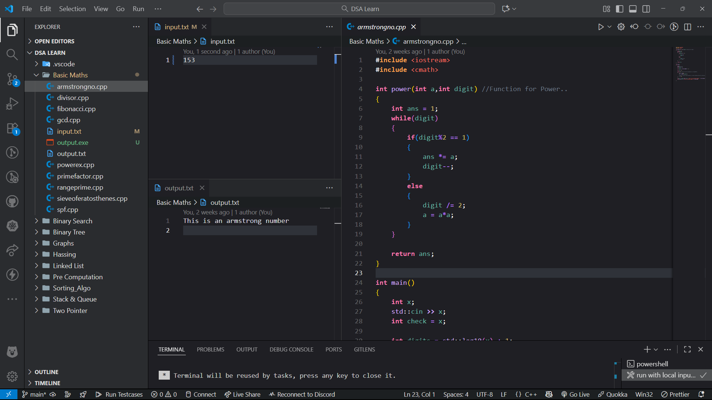

# Data Structures and Algorithms

This repository is a personal collection of C++ implementations for common Data Structures and Algorithms (DSA). It's structured by topic, with each folder containing code, sample inputs, and outputs.

## Topics Covered

This guide is arranged in a logical learning order, from foundational concepts to more advanced data structures. Click on any topic to jump directly to that section.

1.  [Basic Maths](#1-basic-maths)
2.  [Sorting Algorithms](#2-sorting-algorithms)
3.  [Binary Search](#3-binary-search)
4.  [Hashing](#4-hashing)
5.  [Linked List](#5-linked-list)
6.  [Stack & Queue](#6-stack--queue)
7.  [Pre Computation](#7-pre-computation)
8.  [Two Pointer](#8-two-pointer)
9.  [Binary Tree](#9-binary-tree)
10. [Heap](#10-heap)
11. [Graphs](#11-graphs)
12. [Dynamic Programming](#12-dynamic-programming)

---

## How to Compile & Run (VS Code)

This repository is configured with a default VS Code build task to compile and run files with I/O redirection automatically.

### 1. Setup

1.  Make sure you have a **`.vscode`** folder in the root of this project.
2.  Inside `.vscode`, ensure you have a **`tasks.json`** file.
3.  You must have **`g++`** installed and added to your system's PATH.

### 2. How to Use

1.  Open any C++ file you want to run (e.g., `Graphs/BFS/bfsBasic.cpp`).
2.  Make sure an **`input.txt`** file exists in the *same folder* as the C++ file.
3.  Press **`Ctrl+Shift+B`** (or `Cmd+Shift+B` on Mac).

This will compile the file, run the resulting `output.exe`, and feed it the `input.txt`. The program's results will be saved in the `output.txt` file in that same directory.

**Example of running a C++ file with input/output redirection:**


---

### 1. Basic Maths
Folder: **[1. Basic Maths](1.%20Basic%20Maths)** Implementations of fundamental mathematical algorithms needed for problem-solving.
* [`1.armstrongno.cpp`](1.%20Basic%20Maths/1.armstrongno.cpp)
* [`2.divisor.cpp`](1.%20Basic%20Maths/2.divisor.cpp)
* [`3.fibonacci.cpp`](1.%20Basic%20Maths/3.fibonacci.cpp)
* [`4.gcd.cpp`](1.%20Basic%20Maths/4.gcd.cpp)
* [`5.powerex.cpp`](1.%20Basic%20Maths/5.powerex.cpp)
* [`6.primefactor.cpp`](1.%20Basic%20Maths/6.primefactor.cpp)
* [`7.rangeprime.cpp`](1.%20Basic%20Maths/7.rangeprime.cpp)
* [`8.sieveoferatosthenes.cpp`](1.%20Basic%20Maths/8.sieveoferatosthenes.cpp)
* [`9.spf.cpp`](1.%20Basic%20Maths/9.spf.cpp) (Smallest Prime Factor)

### 2. Sorting Algorithms
Folder: **[2. Sorting_Algo](2.%20Sorting_Algo)** Implementations of fundamental sorting algorithms.
* [`1.bubbleSort.cpp`](2.%20Sorting_Algo/1.bubbleSort.cpp)
* [`2.selectionSort.cpp`](2.%20Sorting_Algo/2.selectionSort.cpp)
* [`3.insertionSort.cpp`](2.%20Sorting_Algo/3.insertionSort.cpp)
* [`4.mergeSort.cpp`](2.%20Sorting_Algo/4.mergeSort.cpp)
* [`5.quickSort.cpp`](2.%20Sorting_Algo/5.quickSort.cpp)
* [`6.heapSort.cpp`](2.%20Sorting_Algo/6.heapSort.cpp)

### 3. Binary Search
Folder: **[3. Binary Search](3.%20Binary%20Search)** Algorithms based on the Binary Search principle, which requires sorted data.
* [`1.searchConcept.cpp`](3.%20Binary%20Search/1.searchConcept.cpp)
* [`2.insertBS.cpp`](3.%20Binary%20Search/2.insertBS.cpp) (Position to insert element)
* [`3.uplowbound.cpp`](3.%20Binary%20Search/3.uplowbound.cpp) (Upper and Lower Bound)
* [`4.occurrence.cpp`](3.%20Binary%20Search/4.occurrence.cpp) (Finding first/last occurrence)
* [`5.rotatedBS.cpp`](3.%20Binary%20Search/5.rotatedBS.cpp) (Searching in a rotated array)
* [`6.hmtrotated.cpp`](3.%20Binary%20Search/6.hmtrotated.cpp) (How many times rotated)

### 4. Hashing
Folder: **[4. Hashing](4.%20Hashing)** Techniques for fast lookups and data storage.
* [`1.hasharray.cpp`](4.%20Hashing/1.hasharray.cpp) (Hashing using arrays)
* [`2.hashmapset.cpp`](4.%20Hashing/2.hashmapset.cpp) (Using C++ STL `map` and `set`)

### 5. Linked List
Folder: **[5. Linked List](5.%20Linked%20List)** Implementations of linear, node-based data structures.
* [`1.LL1D.cpp`](5.%20Linked%20List/1.LL1D.cpp) (Singly Linked List)
* [`2.LL2D.cpp`](5.%20Linked%20List/2.LL2D.cpp) (Doubly Linked List)

### 6. Stack & Queue
Folder: **[6. Stack & Queue](6.%20Stack%20%26%20Queue)** Implementations of Stack (LIFO) and Queue (FIFO) data structures.
* **[Basic Implementation](6.%20Stack%20%26%20Queue/Basic%20Implementation):**
    * [`1.stackwitharray.cpp`](6.%20Stack%20%26%20Queue/Basic%20Implementation/1.stackwitharray.cpp)
    * [`2.stackwithLL.cpp`](6.%20Stack%20%26%20Queue/Basic%20Implementation/2.stackwithLL.cpp)
    * [`3.queuewitharray.cpp`](6.%20Stack%20%26%20Queue/Basic%20Implementation/3.queuewitharray.cpp)
    * [`4.queuewithLL.cpp`](6.%20Stack%20%26%20Queue/Basic%20Implementation/4.queuewithLL.cpp)
* **[Balanced Parentheses](6.%20Stack%20%26%20Queue/Balanced%20Parentheses):**
    * [`1.balanceParen.cpp`](6.%20Stack%20%26%20Queue/Balanced%20Parentheses/1.balanceParen.cpp)
* **[Conversion](6.%20Stack%20%26%20Queue/Conversion):**
    * [`1.stack2queue.cpp`](6.%20Stack%20%26%20Queue/Conversion/1.stack2queue.cpp)
    * [`2.queue2stack.cpp`](6.%20Stack%20%26%20Queue/Conversion/2.queue2stack.cpp)
* **[Prefix, Postfix & Infix](6.%20Stack%20%26%20Queue/Prefix%2C%20Postfix%20%26%20Infix):**
    * [`1.infix2postfix.cpp`](6.%20Stack%20%26%20Queue/Prefix%2C%20Postfix%20%26%20Infix/1.infix2postfix.cpp)
    * [`2.infix2prefix.cpp`](6.%20Stack%20%26%20Queue/Prefix%2C%20Postfix%20%26%20Infix/2.infix2prefix.cpp)
    * [`3.postfix2infix.cpp`](6.%20Stack%20%26%20Queue/Prefix%2C%20Postfix%20%26%20Infix/3.postfix2infix.cpp)
    * [`4.postfix2prefix.cpp`](6.%20Stack%20%26%20Queue/Prefix%2C%20Postfix%20%26%20Infix/4.postfix2prefix.cpp)
    * [`5.prefix2infix.cpp`](6.%20Stack%20%26%20Queue/Prefix%2C%20Postfix%20%26%20Infix/5.prefix2infix.cpp)
    * [`6.prefix2postfix.cpp`](6.%20Stack%20%26%20Queue/Prefix%2C%20Postfix%20%26%20Infix/6.prefix2postfix.cpp)

### 9. Binary Tree
Folder: **[9. Binary Tree](9.%20Binary%20Tree)** Implementation of non-linear, hierarchical tree data structures.
* **[Basic Tree](9.%20Binary%20Tree/Basic%20Tree):**
    * [`1.linkedBinaryTree.cpp`](9.%20Binary%20Tree/Basic%20Tree/1.linkedBinaryTree.cpp) (Linked list representation)
    * [`2.operationInBT.cpp`](9.%20Binary%20Tree/Basic%20Tree/2.operationInBT.cpp) (Core operations)
* **[Binary Search Tree (BST)](9.%20Binary%20Tree/Binary%20Search%20Tree):**
    * *(Contains BST-specific algorithms)*

### 10. Heap
Folder: **[10. Heap](10.%20Heap)** Implementation of heap data structure and heap-related algorithms.
* **[Implementation](10.%20Heap/Implementation):**
    * [`1.maxheap.cpp`](10.%20Heap/Implementation/1.maxheap.cpp) (Max Heap implementation with insert and heapifyUp)
* **[Build Heap](10.%20Heap/Build%20Heap):**
    * [`1.buildHeap.cpp`](10.%20Heap/Build%20Heap/1.buildHeap.cpp) (Building heap from array)

### 11. Graphs
Folder: **[11. Graphs](11.%20Graphs)** Implementations of various graph algorithms and representations.
* [`1.representation.cpp`](11.%20Graphs/1.representation.cpp) (Adjacency matrix/list)
* **[BFS (Breadth-First Search)](11.%20Graphs/BFS):**
    * [`1.bfsBasic.cpp`](11.%20Graphs/BFS/1.bfsBasic.cpp)
    * [`2.knight.cpp`](11.%20Graphs/BFS/2.knight.cpp) (Knight's shortest path)
* **[DFS (Depth-First Search)](11.%20Graphs/DFS):**
    * [`1.dfsBasic.cpp`](11.%20Graphs/DFS/1.dfsBasic.cpp)
    * [`2.height&depth.cpp`](11.%20Graphs/DFS/2.height&depth.cpp)
    * [`3.diameter.cpp`](11.%20Graphs/DFS/3.diameter.cpp) (Diameter of a tree)
    * [`4.precomputation.cpp`](11.%20Graphs/DFS/4.precomputation.cpp) (DFS for precomputation)
    * [`5.lca.cpp`](11.%20Graphs/DFS/5.lca.cpp) (Lowest Common Ancestor)
    * [`6.iscyclic.cpp`](11.%20Graphs/DFS/6.iscyclic.cpp) (Detecting cycles)
    * [`7.connectedcom.cpp`](11.%20Graphs/DFS/7.connectedcom.cpp)
    * [`8.treeDfs.cpp`](11.%20Graphs/DFS/8.treeDfs.cpp)
* **[Algorithm](11.%20Graphs/Algorithm):**
    * [`1.dijkstra.cpp`](11.%20Graphs/Algorithm/1.dijkstra.cpp)
    * [`2.bellmanFord.cpp`](11.%20Graphs/Algorithm/2.bellmanFord.cpp)
    * [`3.floydWarshall.cpp`](11.%20Graphs/Algorithm/3.floydWarshall.cpp)
    * [`4.Cycle_Finding.cpp`](11.%20Graphs/Algorithm/4.Cycle_Finding.cpp)
    * [`5.dsu.cpp`](11.%20Graphs/Algorithm/5.dsu.cpp) (Disjoint Set Union)

### 12. Dynamic Programming
Folder: **[12. Dynamic Programming](12.%20Dynamic%20Programming)** Solutions using dynamic programming techniques.
* **[1D DP](12.%20Dynamic%20Programming/1D_DP):**
    * [`1.fibo.cpp`](12.%20Dynamic%20Programming/1D_DP/1.fibo.cpp) (Fibonacci using DP)

## How to Use (Manual Compilation)

If not using the VS Code task, you can compile and run files manually.

**Compile a file:**
```bash
g++ filename.cpp -o filename.exe
